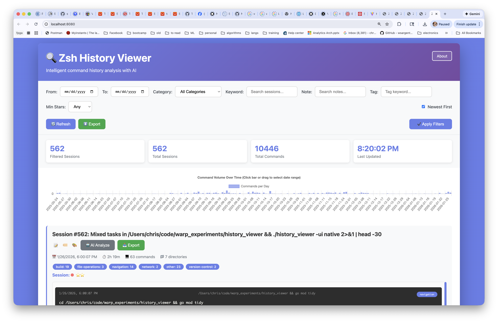

# Zsh History Viewer

A powerful Go-based tool for analyzing your zsh command history with AI-powered insights via Ollama and comprehensive filtering, visualization, and export capabilities.

**Available in two modes:**
- **Web UI**: Browser-based interface with interactive charts (default)
- **Native UI**: Cross-platform desktop application for macOS and Linux

## Features

### Core Features
- 📊 **Session Grouping**: Automatically groups commands into sessions based on configurable time gaps (default: 30 minutes)
- 🏷️ **Smart Categorization**: 13 command categories including VCS, build, file operations, navigation, dev tools, containers, databases, and more
- 📂 **Directory Tracking**: Automatically infers and tracks working directories by parsing cd commands
- ⏱️ **Time-based Analysis**: Groups and analyzes commands by when they were executed

### Filtering & Search
- 📅 **Date Range Filtering**: Filter sessions by specific date ranges using date pickers
- 📊 **Visual Timeline**: Interactive volume chart showing command frequency over time
- 🎯 **Drag Selection**: Click and drag on the chart to visually select date ranges
- 🔍 **Keyword Search**: Search across session descriptions and commands
- 🏷️ **Category Filtering**: Filter by specific command categories
- 🔄 **Sort Control**: Toggle between newest-first and oldest-first ordering

### AI Integration (via Ollama)
- 🤖 **Explain Sessions**: Get formatted markdown explanations of what a session accomplished
- 💬 **Custom Prompts**: Ask any question about your commands ("What files were modified?", "What was I debugging?", etc.)
- 🔄 **Plain Text Output**: Custom prompt responses in clean, monospace plain text
- 📝 **Markdown Rendering**: Explanations rendered with proper formatting, headers, code blocks, and lists

### Export & Code Generation
- 💾 **Data Export**: Export filtered sessions to JSON, CSV, Markdown, or cleaned zsh history format
- 🔧 **Direct Code Export**: Convert session commands to executable scripts without AI:
  - Bash scripts with error handling
  - Python programs with subprocess execution
  - Java classes with ProcessBuilder
  - Go programs with exec.Command
- 📥 **Download to File**: All exports download directly to your machine

### User Interface
- 🎨 **Modern Design**: Gradient purple theme with smooth animations and hover effects
- 🔄 **Auto-refresh**: Updates every 30 seconds while preserving active AI results
- 📱 **Responsive Layout**: Works on various screen sizes
- 🎯 **Smart Interactions**: Hover effects, visual feedback, and intuitive controls

## Screenshots


*Main interface showing the command timeline, filtering controls, and session cards*

## Prerequisites

- Go 1.23 or higher
- Zsh with extended history enabled
- [Ollama](https://ollama.ai/) (optional, for AI features)
- For native UI: Platform-specific GUI dependencies (see BUILD.md)

## Quick Start

1. **Build the application:**
```bash
go build -o history_viewer
```

2. **Run it:**
```bash
# Web UI (default)
./history_viewer

# Native desktop UI
./history_viewer -ui native
```

3. **Open in browser** (web UI only): http://localhost:8080

For detailed build instructions and prerequisites, see [BUILD.md](BUILD.md).

## Configuration

The tool automatically creates a config file at `~/.history_viewer.json` on first run with these defaults:

```json
{
  "history_file": "~/.zsh_history",
  "port": 8080,
  "session_timeout_minutes": 30,
  "ollama_url": "http://localhost:11434",
  "ollama_model": "llama3.3",
  "auto_refresh_seconds": 30,
  "home_dir": "/Users/yourusername"
}
```

**Configuration options:**
- `history_file` - Path to your zsh history file
- `port` - Web server port (default: 8080, web UI only)
- `session_timeout_minutes` - Minutes of inactivity before starting a new session
- `ollama_url` - Ollama API endpoint for AI features
- `ollama_model` - Model to use (e.g., llama3.3, codellama, etc.)
- `auto_refresh_seconds` - How often the UI auto-refreshes
- `home_dir` - User's home directory (auto-detected)

### Enabling Extended History in Zsh

The tool works best with extended history. Add these lines to your `~/.zshrc`:

```bash
HIST_STAMPS="yyyy-mm-dd"
setopt EXTENDED_HISTORY          # Write timestamps and durations
setopt INC_APPEND_HISTORY        # Write to history file immediately
setopt HIST_IGNORE_DUPS          # Don't record duplicate consecutive commands
setopt HIST_FIND_NO_DUPS         # Don't display duplicates when searching
setopt HIST_REDUCE_BLANKS        # Remove superfluous blanks
export HISTSIZE=50000            # Number of commands in memory
export SAVEHIST=50000            # Number of commands saved to file
```

Then reload your config:
```bash
source ~/.zshrc
```

## Usage

### Web UI (Default)

Start the web server:
```bash
./history_viewer
```

Then open your browser to: **http://localhost:8080**

The web UI provides:
- Interactive command timeline with drag-to-zoom
- Responsive design that works on desktop and tablet
- Real-time auto-refresh every 30 seconds
- Export to file downloads

### Native UI

Launch the desktop application:
```bash
./history_viewer -ui native
```

The native UI provides:
- Cross-platform desktop app (macOS, Linux, Windows)
- Native file dialogs for saving exports
- No browser required
- Embedded web view with all web UI features
- Runs standalone without a separate server

### Command-line Options

```bash
# Use native desktop UI
./history_viewer -ui native

# Use a different port (web UI only)
./history_viewer -port 9000

# Use a different history file
./history_viewer -history /path/to/custom/.zsh_history

# Combine options
./history_viewer -ui native -history ~/.zsh_history_backup
```

**Available flags:**
- `-ui` - UI mode: 'web' (default) or 'native'
- `-port` - Web server port (default: 8080, web UI only)
- `-history` - Path to zsh history file (default: ~/.zsh_history)

## Features Guide

### Sessions View
- Commands are automatically grouped into sessions based on time gaps (default: 30 minutes)
- Each session shows:
  - Start/end time and duration
  - Number of commands
  - Working directories
  - Command categories
  - First 5 commands (expandable)

### AI Analysis (Requires Ollama)

Click "🤖 AI Analyze" on any session to:
- **Explain**: Get a clear explanation of what the commands do
- **Rewrite**: Get suggestions for more efficient versions
- **Create Script**: Convert to a complete bash script
- **→ Python/Java/Go**: Translate commands to other languages

### Command Patterns
Switch to "Command Patterns" view to see:
- Most frequently used commands
- Which commands are often used together in sessions
- Category breakdowns

### Search
- Real-time search across commands and directories
- Results update as you type

### Export
Export your history in multiple formats:
- **JSON**: Complete structured data
- **CSV**: Spreadsheet-compatible format
- **Markdown**: Human-readable documentation
- **Zsh History**: Cleaned history file format

## API Endpoints

The tool exposes a REST API:

- `GET /api/sessions` - List all sessions
- `GET /api/sessions/:id` - Get specific session details
- `GET /api/commands` - List all commands
- `GET /api/search?q=query` - Search commands
- `GET /api/patterns` - Get command patterns and co-occurrence
- `GET /api/stats` - Get statistics
- `POST /api/refresh` - Refresh data from history file
- `GET /api/export?format=json&session=1` - Export data
- `POST /api/llm/analyze` - Analyze with LLM
- `GET /api/config` - Get configuration
- `PUT /api/config` - Update configuration

## Setting up Ollama (Optional)

1. Install Ollama from https://ollama.ai/

2. Pull the llama3.3 model:
```bash
ollama pull llama3.3
```

3. Start Ollama (it usually starts automatically):
```bash
ollama serve
```

4. The history viewer will automatically connect to Ollama at http://localhost:11434

## Troubleshooting

### Fyne locale warning (Native UI)
If you see "Failed to load user locales" warning on macOS:
```bash
defaults write -g AppleLanguages -array en-US
```

### History file not found
Make sure your zsh history file exists at `~/.zsh_history`. You can check with:
```bash
ls -la ~/.zsh_history
```

If it's in a different location, use the `-history` flag or update `~/.history_viewer.json`.

### No timestamps in history
If your history doesn't have timestamps, enable extended history (see Configuration section above). Note that only new commands will have timestamps.

### Ollama connection errors
- Make sure Ollama is running: `ollama list`
- Check the Ollama URL in `~/.history_viewer.json`
- Try pulling the model: `ollama pull llama3.3`
- Update the config to use a different model if needed

### Port already in use (Web UI)
Use the `-port` flag to specify a different port:
```bash
./history_viewer -port 9000
```

Or kill the process using port 8080:
```bash
lsof -ti:8080 | xargs kill
```

### Build errors (Native UI)
If you get build errors with the native UI:
- macOS: Install Xcode command line tools: `xcode-select --install`
- Linux: Install required packages (see BUILD.md)
- Use web UI as fallback: `./history_viewer` (without `-ui native`)

## License

MIT License

## Contributing

Contributions are welcome! Feel free to open issues or submit pull requests.
